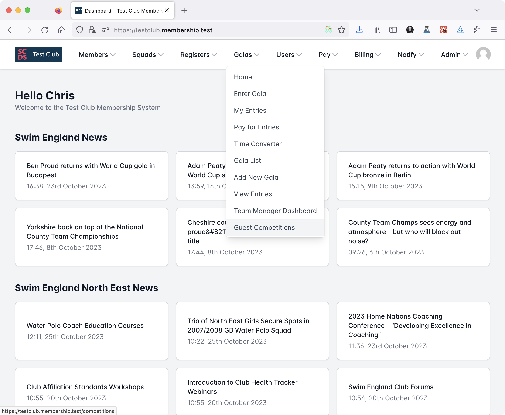

# Create a competition

To create a new V2 Competition, head to the competitions home page. You can currently do this by selecting *Guest Competitions* in the main menu.

From the Competitions home page, click *New*.

Fill in the required fields on the new competition page.

:::info

You will need to have created a Venue before you start creating a competition.

:::

Once you've filled in the basic information, you can add sessions and events to the competition. Once this is complete, edit the competition to change its *Publication status* to *Published*.

:::note

Competitions V2 currently only supports guest competition entries.

:::