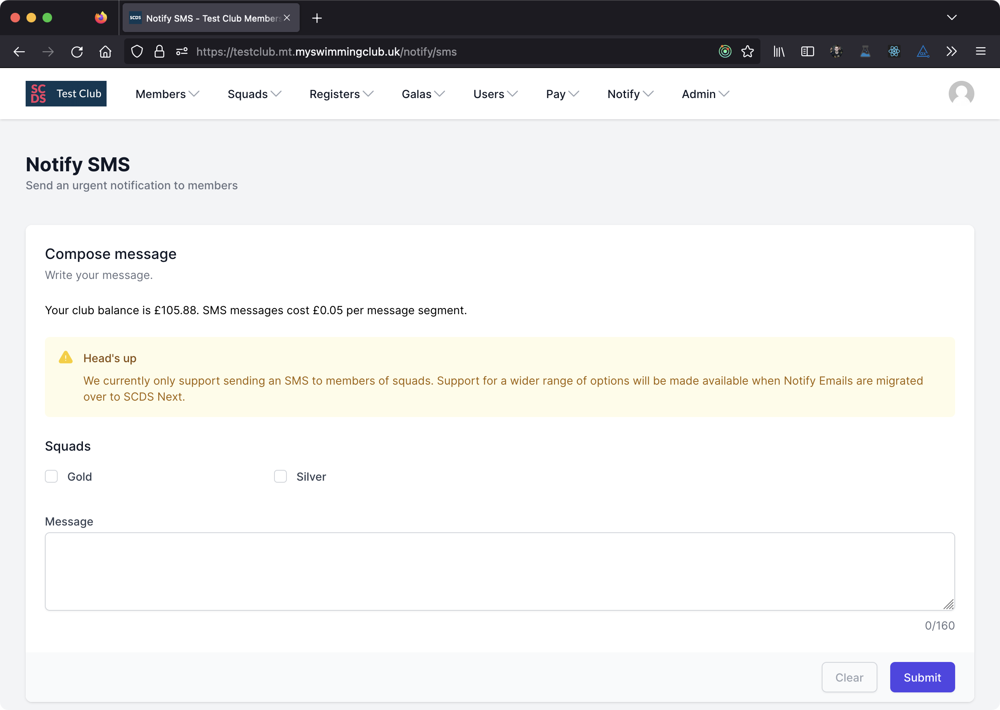

# Notify SMS

Notify SMS allows you to rapidly send a message to squad members. This is useful in the event of late session cancellations because SMS messages have a higher open rate and are read more quickly than email messages.

Notify SMS is a Pay As You Go feature - you must have a positive account balance to use Notify SMS.

## Compose a Notify SMS

To create a new Notify SMS message, select *Notify* then *Compose SMS* from the main menu.

:::note

If your account balance is negative or zero, you won't be able to compose an SMS.

:::

On the Compose SMS page, choose the squads you want to send a message to then write your message in the message box.

:::info

Your message can be up to 160 characters in length, though you may incur additional fees if you use emojis or other special characters in your message.

:::

When you're ready, click Send.

:::info

We'll add support for Targeted Lists and other groups when we migrate Notify Emails to SCDS Next.

:::

## SMS Sender ID (Alphanumeric Sender ID)

An Alphanumeric Sender ID is your company name or brand used as the Sender ID in one-way SMS messages. Alphanumeric Sender IDs may be up to 11 characters long. Accepted characters include both upper- and lower-case Ascii letters, the digits 0 through 9, and the space character. They may not be only numerals.

To set your SMS Sender ID, navigate to your tenant in SCDS System Administration and select *Details* from the menu. Enter a value in the *SMS Sender ID* field.

If you do not choose your own Sender ID, we'll use *SWIM CLUB* as the default value.

## How SMS messages are billed

When you send an SMS message through the SCDS Membership System, you'll be billed for each *message segment* sent. Most messages will consist of just one message segment, but if you include special characters such as emoji of CJK characters, the message might consist of multiple message segments. In this case you may find the price per message is higher than expected.

SCDS charges £0.05 per *message segment*.

[Find out more about SMS character limits from our service provider, Twilio](https://www.twilio.com/docs/glossary/what-sms-character-limit).

We don't know before we start sending messages exactly what it will cost, therefore we check your balance before sending to each individual user. We'll then debit your account for that individual message.

We will stop sending messages if your account Pay As You Go balance reaches zero or goes negative. This means if your account balance was low before you pressed *Send*, the message may not be delivered to all the users that you expected.

You may still be billed if a message is not delivered to the recipient. This is because SCDS is still billed by SCDS in such circumstances. You won't be billed if a message fails Twilio's validation.