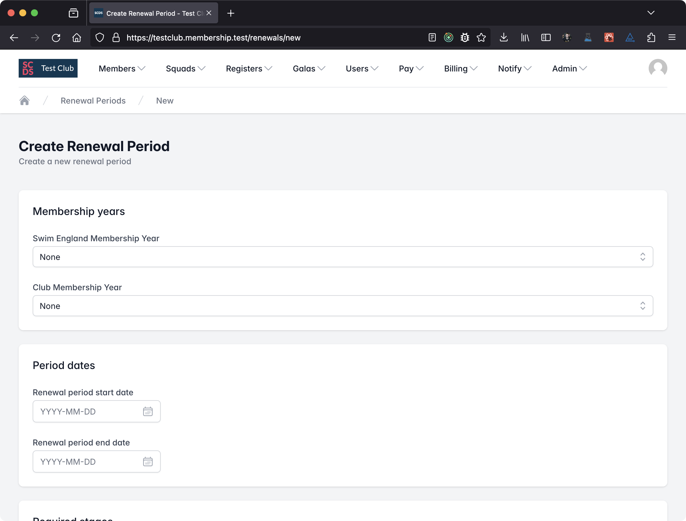
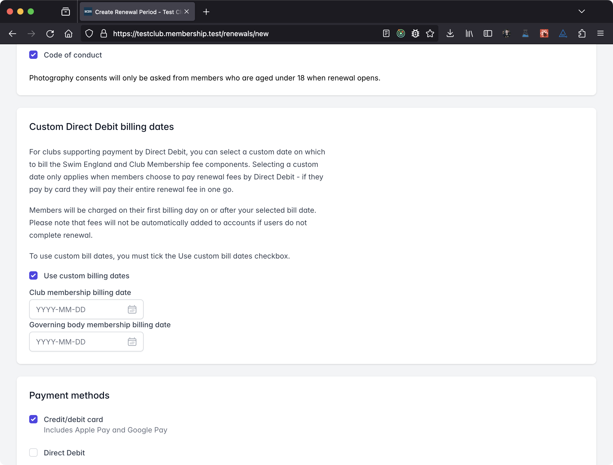
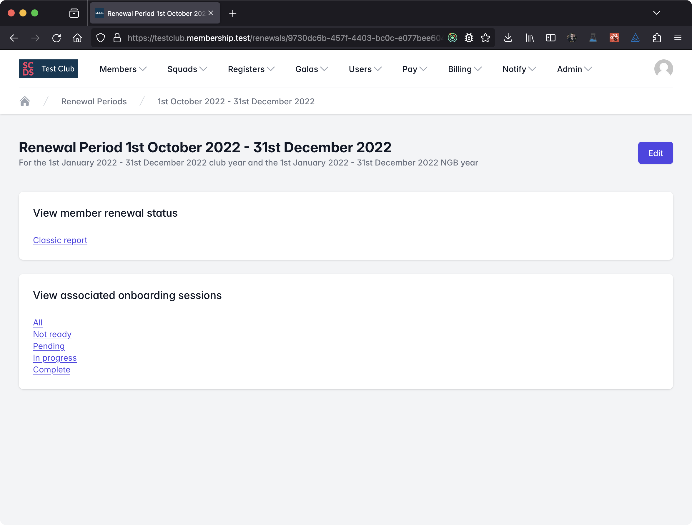

# Membership renewal

Membership renewal is a busy and complex time of year, therefore we try to make our renewal software as simple as possible.

## Quick start

To get started quickly with membership renewal you will need to;

1. [Create a membership year](../membership-years.md) - We'll be renewing membership for that year
2. Create a renewal period
    1. Choose your start and end dates
    2. Choose your required steps
    3. Choose your payment methods
3. Tell your members how they can complete renewal and how long they have to renew

## Creating a membership renewal period

To get started, head to the *Membership Centre*. You can find this in the *Members* dropdown in the main menu.

:::tip

Don't forget to make sure you've [set up a membership year](../membership-years.md) before you create your renewal period!

:::

Now select *Membership Renewal*. You'll see a list of all current and previous renewal periods. To add a new period, click *New* in the top right.

The page will look like this;

Now let's fill in the required information. Start by choosing a membership year for your Swim England and/or Club Membership years. You can choose from any of the latest 15 current or future membership year, or **None** if one does not apply (e.g. your club does not charge an annual club membership fee). You can choose different membership years for each if your club membership year does not run concurrently with the Swim England one.

At most clubs, the club and Swim England membership years run concurrently with the same start and end dates (usually 1 Jan - 31 Dec). If this applies to you, select the same membership year from both dropdowns.

If you club does not have an annual **Club Membership**, select None for your **Club Membership** membership year.

If your club and Swim England membership years run with different dates, please either;

- Select the appropriate membership year for club and Swim England fees. Members will pay for both types at the same time.
- Select a membership year for the appropriate membership type you want to renew and select None for the other. You can repeat this the other way around when you want to renew the other type (you may wish to remove some of the required stages for one of the renewals). In this case, members will only renew and pay for the type of membership you chose a membership year for.

:::warning

You must pick a year under at least one of the options.

:::

Now let's pick a start and end date for the renewal period. These can be anything you like, but you should always pick a start date that is in the future - this is because we will calculate who needs to renew as part of a batch process which runs overnight on your selected start date, and it will not run if you select today's date or a date in the past.

After this, select your required stages. Communication options are mandatory and help you comply with GDPR by easily allowing members to review their options. Set account password is unavailable because it is only allowed during onboarding.

Then choose the payment methods you want to allow members to use to pay their renewal fee. You can override these on a case by case basis once renewal has started.

### Custom Direct Debit billing dates

If members choose to pay by Direct Debit, you can choose to use custom posting dates for the transactions. This allows you to bill Swim England and Club Membership fees over separate months to reduce the financial burden on families.

This option will not apply to payments made via any other means.

To do this, tick the *Use custom billing dates* box and enter the dates you would like to use for Swim England and Club Membership fees.

This setting will be ignored if you do not tick the box. You can change this setting later on in the renewal period, but any changes will not apply to any renewals which have already been completed.

:::info

Don't forget to enable the option to pay for renewal by Direct Debit if you select custom billing dates.

:::

The custom billing dates section looks like this;

## Viewing Renewal status

The easiest way to view the status of membership renewal if to use the *Classic Report*. To do this, from the membership renewal homepage, click on the renewal period you want to view information for.

You will see a page like this;

From here you can either manage individual renewal periods by viewing associated onboarding sessions, or view the *Classic Report*.

This page shows a list of members in this renewal period. The most recently paid members are first, with members then sorted by last name then first name.

## Adjusting fees

If you need to adjust a renewal fee because a member wishes to change their membership category, e.g. they wish to switch to Swim England Club Train from Swim England Club Compete, navigate to the renewal period, then choose a filter to find the appropriate onboarding session. Once you find the onboarding session, scroll to the bottom and select *Edit fees*.

This will take you to the associated membership batch page where you can add, remove and adjust membership classes and fees.

Once you're done, click Save.

:::caution

You're unable to adjust these fees after a user has completed membership renewal. Members should be advised to check their assigned memberships and fees before proceeding.

:::