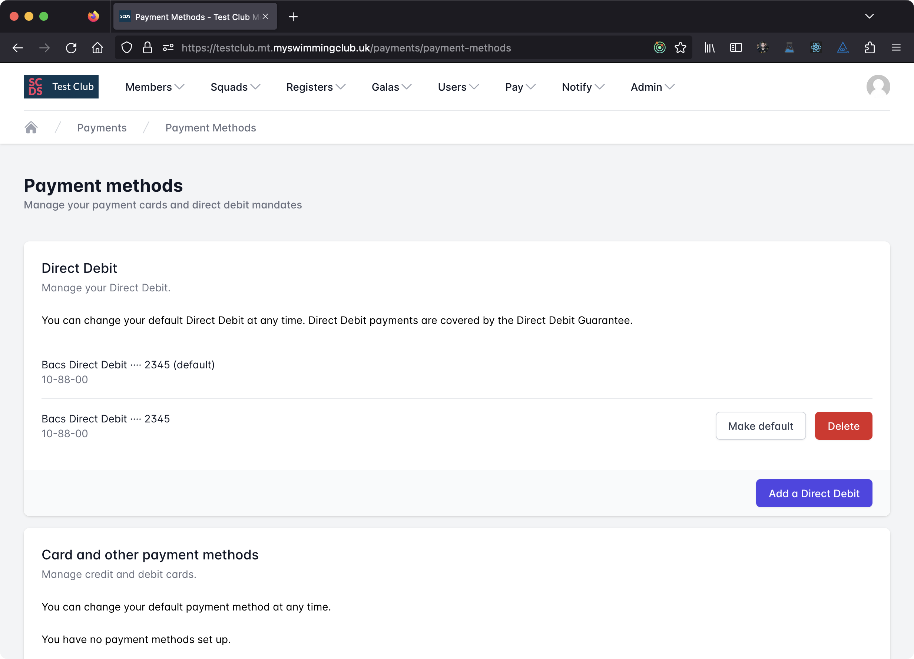
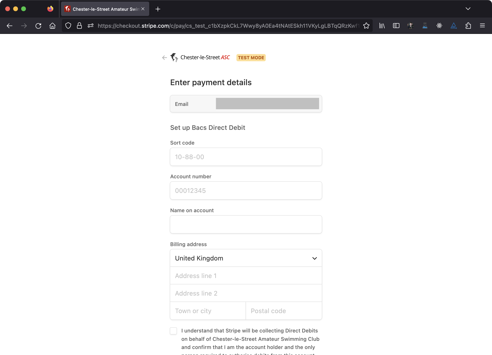

# Add a new Payment Method

You can easily save a new payment method to your account. To do this, select *Payment Methods* from the *Billing* menu
in the membership system.

## Set up a new Direct Debit Instruction

If your club accepts Direct Debit payments, you'll see a Direct Debit section on the page. You'll be shown a list of
your current Direct Debit instructions, if any.

Click on *Add a payment method* to set up a new Direct Debit.

Follow the instructions to set up a new Direct Debit Instruction.

If this is your first Direct Debit Instruction with a club, it will automatically become your default Direct Debit. If
it's not your first, it will not become your default. To change your default, click *Make default*. To cancel a Direct
Debit instruction, click *Delete*. You can also cancel a Direct Debit Instruction at your bank.

Your default Direct Debit will be used for monthly fee payments.

## Add any other payment method

Click *Add a payment method* in the *Card and other payment methods* section, then follow the on-screen instructions.
You can't choose a default from these, as you'll always be given a choice on our checkout pages.