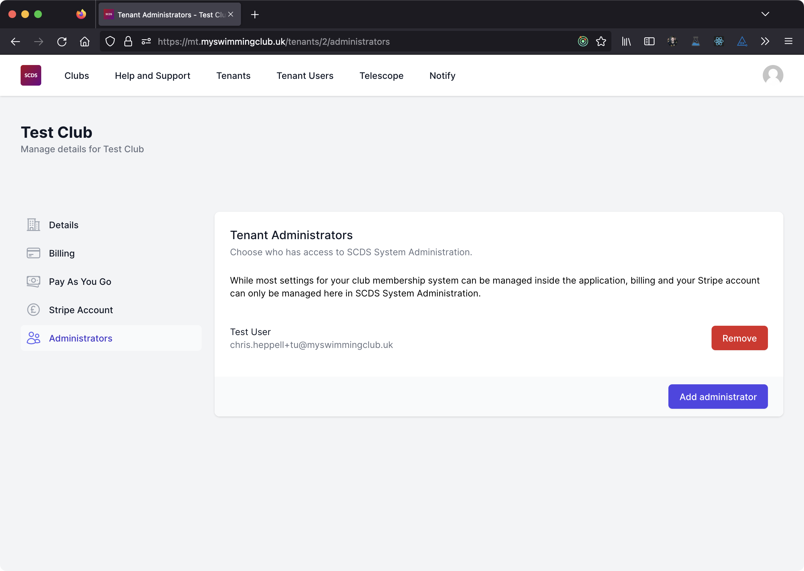
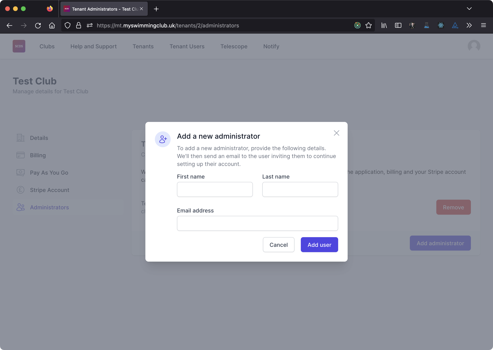

# Accessing SCDS System Administration

To manage your club, you'll need to have an account in SCDS System Administration which is linked to your tenant. If you do not already have an account in SCDS System Administration, someone at your club will be able to create an account and give you access.

:::note

Accounts in SCDS System Administration are completely seperate from your normal membership system account. This is so that you can access tenant billing even if your subscription lapses.

[Login to SCDS System Administration](https://myswimmingclub.uk/login)

[Login to your club account](https://myswimmingclub.uk/clubs)

:::

## Adding an administrator

To add a user to SCDS System Administration, navigate to your tenant in SCDS System Administration and select *Administrators* from the menu. You'll see a list of users on screen.

To add a new administrator click on *Add administrator*. You'll be asked to enter their name and email address.

:::note

If a user with that email address already exists in SCDS System Administration, we'll assign access to your tenant to that account. The user will log in with their existing account details.

:::

The user will be sent an email notifying them that they have been made an administrator. If the user does not already have an account in SCDS System Administration, the email will invite them the set a password by following the reset password process.

## Deleting an administrator

Any administrator can remove administrators from your tenant in SCDS System Administration. This only removes their permissions relating to you tenant and does not delete their SCDS System Administration account.

To delete a user from your tenant in SCDS System Administration, navigate to your tenant in SCDS System Administration and select *Administrators* from the menu. You'll see a list of users on screen.

Click on *Delete* next to the user you want to remove from your tenant.

:::info

You can not delete yourself from a tenant.

:::

:::info

If someone who had administrator permissions went rogue and removed everyone from the tenant, contact SCDS. We have the ability to manage admin permissions for all tenants.

:::