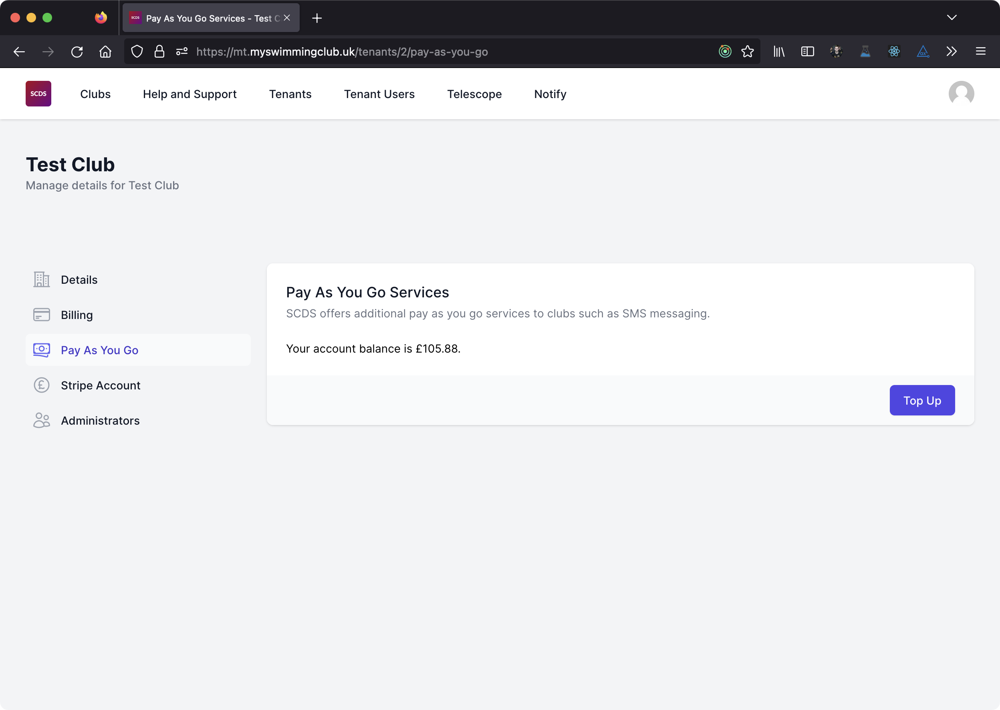

# Pay As You Go

SCDS is rolling out additional features which are not included in the monthly subscription fee such as Notify SMS functionality which is billed on a per message basis.

These features utilise a Pay As You Go balance which you must top up in advance.

## Check your Pay As You Go balance

To top up your Pay As You Go balance, navigate to your tenant in SCDS System Administration and select *Pay As You Go* from the menu. You'll see your current balance on screen.

You can also see your balance in screens throughout the membership system which are part of Pay As You Go services, for example in the Compose SMS screen.

## Top up your Pay As You Go balance

To top up your Pay As You Go balance, navigate to the *Pay As You Go* screen. Then click on *Top Up*.

You can choose how much you wish to top up your balance by. The minimum top up is £20.00 and the maximum top up is £50.00.

:::note

You can only use credit, debit or charge cards to top up your Pay As You Go balance. We don't accept Direct Debit payments for top ups due to the time taken for the payment to be confirmed.

:::

## Using Pay As You Go Services

As you use Pay As You Go services, we'll debit your Pay As You Go account balance. This is usually on a per billable item basis, though some services may be introduced with different arrangements.

You can't use any Pay As You Go services once your balance reaches zero or goes negative.

SCDS may in future introduce services which have a higher minimum balance requirement.

## Services

You can use your Pay As You Go balance for the following services;

* Notify SMS

Your Pay As You Go balance can not be used towards monthly subscription payments.