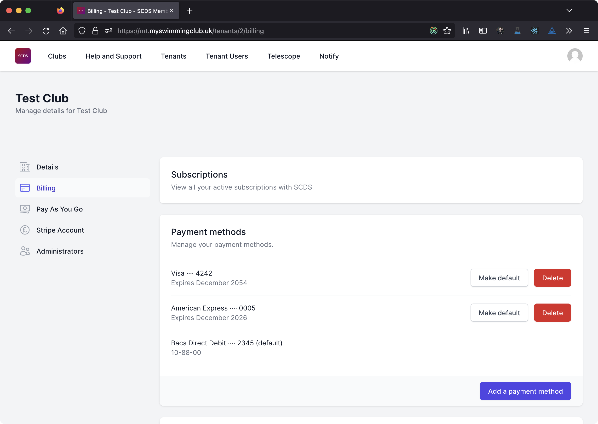

# Tenant Billing

Clubs (tenants) pay a monthly subscription for the membership system. Payment is taken automatically each month. Payments are usually processed on the first day of the month, but if a club needs to pay at a different date, for cashflow reasons, they can contact SCDS for a bespoke arrangement.

To visit tenant billing, navigate to your tenant and select *Billing* from the menu. You'll see details about your subscriptions, payment methods and recent invoices.

## Payment Methods

You can currently pay for the membership system by;

- Credit, debit or charge card
- Direct Debit

We continually review our payment options and may add additional payment methods in future.

### Adding a payment method

From the *Billing page*, scroll down to the *Payment methods* section. You'll see a list of any current payment methods connected to your club.

To add a new payment method, click on *Add a payment method*. You'll then be asked to choose *Card* or *Bacs Direct Debit*.

:::info

If you create a new Direct Debit Instruction, it may take a few days to be confirmed as usable. If your bank does not accept the Direct Debit Instruction, it will disappear from your list of payment methods.

:::

### Choose a default payment method

Your subscription fees will be billed to your default payment method. To change your default payment method, click on *Make default* next to the payment method. You will be asked to confirm the change.

Your new default payment method will be used for all future subscription payments.

### Delete a payment method

To delete a payment method, click on *Delete* next the the payment method you want to delete. You will be asked to confirm that you want to delete the payment method.

:::info

You can not delete your default payment method as you must always have a payment method set for your subscription.

:::

## Invoices and receipts

Our payment partner will send an email receipt when your payment has been successful. This will include a copy of your invoice and receipt.

If you pay by Direct Debit, you will be sent an email confirming the amount three working days before the payment is taken.

## Billing Periods

All billing is currently monthly and you will get one invoice on the first day of each month with all items on it.

Monthly subscription fees do not include Pay As You Go services provided by SCDS.

## Service suspension due to non-payment

In the event of non-payment, SCDS may withdraw service to a tenant. This may happen automatically after the expiry of a grace period. Clubs will be given the opportunity to arrange payment before this happens.

If your service is suspended, direct debit payments from members may not be processed, or may fail and you will be unable to access user data.